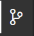
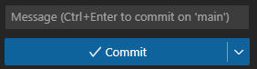
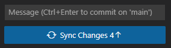

## 🗒️ Requisitos

Para realizar los ejercicios de este tema y poder ejecutar los tests con las librerías empleadas se requiere **una versión de node igual o superior a la 18** [versiones nodejs](https://nodejs.org/en/about/previous-releases)

Si necesitas disponer de diferentes versiones de node en tu equipo, puedes usar [nvm](https://github.com/nvm-sh/nvm)

Adicionalmente, es muy recomendable haber completado los ejercicios de los temas anteriores.


## 📝 Enunciados

> 💡 Cada ejercicio deberás realizarlo en el fichero correspondiente, que estará ubicado en la carpeta de su unidad y con la nomenclatura **u[numero_unidad]e[numero_ejercicio].[tipo_fichero]**.
> Así por ejemplo el ejercicio 2 de la UNIDAD 3 que está en JavaScript lo tendrás localizado, aplicando esta nomenclatura, en: `u3/u3e2.js`.

Los ejercicios los encontrarás organizados por carpetas según las unidades del tema actual. Cada ejercicio se presentará en un fichero `.js`, que puede incluir un esquema inicial de código o simplemente indicar el tema, unidad y ejercicio al que se refiere.

Además por cada ejercicio podrás encontrar **su enunciado** en la misma ubicación y nombre de fichero, pero con extensión de formato markdown `.md`.

Las UNIDADES del TEMA actual (**5. Técnicas para mejorar estructura y robustez de código**) junto con los ejercicios son los siguientes:

| UNIDAD | Enunciados | Ejercicios |
| -------- | ---------- | ---------- |
| 1. Gestión de errores y excepciones  | [u1e1](u1/u1e1.md) | [u1e1](u1/u1e1.js) |

Además, cada ejercicio irá acompañado de uno o varios tests para comprobar que tu solución es correcta. En la sección [Cómo ejecutar los tests](#cómo-ejecutar-los-tests) describimos cómo puedes ejecutar los tests.

Cuando hayas propuesto una implementación para el código requerido, ejecuta los tests para ver si tu solución es correcta. Si no pasa los tests, vuelve a intentarlo revisando los errores que te comentan los tests.

Una vez termines el ejercicio, deberás enviar tus cambios para que se registren en la plataforma y que puedan ser corregidos por tu profesor. En la sección [Entregar ejercicio](#entregar-ejercicio) describimos cómo has de enviar tu solución al ejercicio.


## 🛠️ Cómo ejecutar los tests

Para lanzar los tests deberás ejecutar esta instrucción en el Terminal de tu editor (el Terminal está localizado en la parte inferior de la pantalla): `npm t` o `npm run test`

La instrucción anterior lanzará los tests cada vez que guardes cambios sobre los ficheros JavaScript donde implementarás los ejercicios de esta PEC.

Como puedes esperar, la primera vez que ejecutes `npm t` y se lancen los tests, si no has realizado los ejercicios fallarán todos. Revisa el mensaje de error que se imprime para conocer su formato y entender cómo se notifican los errores.

Este es un ejemplo de una posible salida de error:

```
FAIL  src/u1e1.test.js
  ● Callbacks › Callback execeuted...
      expect(received).toBe(expected) // Object.is equality

      Expected: true
      Received: undefined

      19 |
      20 |         const result = conditionalCallback(1000, callbackFn);
    > 21 |         expect(result).toBe(false);
         |                        ^
      22 |         done();
      23 |     });
      24 |

      at Object.toBe (src/u1e1.test.js:21:24)
```

Es importante fijarse en la descripción del error, por ejemplo, el texto de error anterior indica que para el ejercicio (relativo a la función `conditionalCallback` y el test `Callback executed`) se esperaba una respuesta `true` pero se está recibiendo `undefined`. Adicionalmente se marca la línea y punto del test donde esto ocurre en el código.

Una vez corregido el problema, en cuanto se guarda el fichero donde estamos editando los ejercicios, el test se vuelve a lanzar y nos mostraría:

```
  PASS  src/u1e1.test.js
```

Ahora el test muestra `PASS`.

El comando de pruebas (en el Terminal) tiene un menú (accesible mediante la tecla `w`) que os permite ejecutar los tests selectivamente. Por ejemplo, pulsando `a` podéis relanzar manualmente todos los tests; y pulsando `f` podéis relanzar solamente aquellos tests que han fallado. Probad las diferentes opciones y si tenéis alguna duda, consultadla en el foro de la asignatura.


## 📦 Entregar ejercicio

Para entregar el ejercicio, sigue estos pasos. Ten en cuenta que estos pasos están indicados para VSCode, el IDE que te recomendamos en la Escuela de Programación.

1. Guarda el fichero correspondiente al ejercicio, por ejemplo `u1/u1e1.js` pulsando `CTRL` + `s`

2. Haz click en el icono de la extensión Git en la barra de menú izquierda, este es el icono:

    

3. Haz click en el símbolo `+` para añadir el fichero que quieras enviar:

4. Escribe un mensaje resumiendo tus cambios (por ejemplo, "Submitting exercise") y luego haz click en _Commit_

    

5. Haz click en _Sync Changes_

    

Tu ejercicio ya está entregado, el profesor podrá revisarlo si es necesario.

